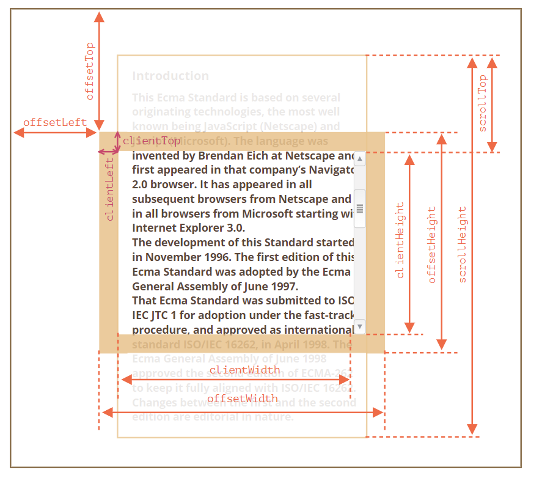

**1.创建新节点的方法：**

- `document.createElement(tag)` — 用给定的标签创建一个元素节点，
- `document.createTextNode(value)` — 创建一个文本节点（很少使用），
- `elem.cloneNode(deep)` — 克隆元素，如果 `deep==true` 则与其后代一起克隆

**2.插入元素**

2.1.简单方法

- `node.append(...nodes or strings)` — 在 `node` 标签内末尾插入节点或字符串，
- `node.prepend(...nodes or strings)` — 在 `node` 标签内开头插入节点或字符串，
- `node.before(...nodes or strings)` — 在 `node` 标签外前面插入节点或字符串，
- `node.after(...nodes or strings)` — 在 `node` 标签外后面插入节点或字符串，
- `node.replaceWith(...nodes or strings)` — 将 `node` 标签替换为给定的节点或字符串。
- 文本字符串被“作为文本”插入。

2.2复杂方法

- `elem.insertAdjacentHTML(where, html)`。 将html 插入到指定位置
- `elem.insertAdjacentText(where, text)`   将 `text` 字符串“作为文本”  插入到指定位置，
- `elem.insertAdjacentElement(where, elem)`   将一个dom元素插入到指定位置。

```
-该方法的第一个参数是代码字（code word），指定相对于 elem 的插入位置。必须为以下之一：
`"beforebegin"` — 将 `html` 插入到 `elem` 前插入，
- `"afterbegin"` — 将 `html` 插入到 `elem` 开头，
- `"beforeend"` — 将 `html` 插入到 `elem` 末尾，
- `"afterend"` — 将 `html` 插入到 `elem` 后。
```

- 如果我们要将一个元素 移动到另一个地方，则无需将其从原来的位置中删除。所有插入方法都会自动从旧位置删除该节点。

**3.删除节点**

-  移除一个节点，可以使用 `node.remove()`。 

**4.克隆节点**

- 调用 `elem.cloneNode(true)` 来创建元素的一个“深”克隆 — 具有所有特性（attribute）和子元素。如果我们调用 `elem.cloneNode(false)`，那克隆就不包括子元素。 

**5.老式的方法添加元素**

- parentElem.appendChild(node)  将 `node` 附加为 `parentElem` 的最后一个子元素。
- parentElem.insertBefore(node, nextSibling)  在 `parentElem` 的 `nextSibling` 前插入 `node`。 
-  `parentElem` .removeChild(node) ` 在 `删除parentElem` 的node 子元素
- parentElem.replaceChild(node, oldChild) 将 `parentElem` 的后代中的 `oldChild` 替换为 `node`。

**6.文档写入**

- `document.write` 调用只在页面加载时工作。

- 如果我们页面加载完毕调用它，则现有文档内容将被擦除。

**7.类名**

-  可以使用 `className` 对完整的类字符串进行操作，
- 可以使用使用 `classList` 对单个类进行操作 

**`classList` 的方法：**

- `elem.classList.add/remove(class)` — 添加/移除类。
- `elem.classList.toggle(class)` — 如果类不存在就添加类，存在就移除它。
- `elem.classList.contains(class)` — 检查给定类，返回 `true/false`。

**8.字符串的形式添加样式**

- 想要以字符串的形式设置完整的样式，可以使用特殊属性 `style.cssText`：  它不是进行添加，而是替换它们 

  ```javascript
  <div id="div">Button</div>
  
  <script>
    // 我们可以在这里设置特殊的样式标记，例如 "important"
    div.style.cssText=`color: red !important;
      background-color: yellow;
      width: 100px;
      text-align: center;
    `;
  
    alert(div.style.cssText);
  </script>
  ```

**9.css的单位**

-  不要忘记将 CSS 单位添加到值上。 否则不起作用

-  **`style` 属性仅对 `"style"` 特性（attribute）值起作用，而没有任何 CSS 级联（cascade）** 

**10.css样式的值获取**

- getComputedStyle(element, [pseudo])

-   element  需要被读取样式值的元素。
- pseudo  伪元素（如果需要），例如 `::before`。空字符串或无参数则意味着元素本身。

-   实际上返回的是属性的解析值   **需要完整的属性名**    
- **应用于** `:visited` **链接的样式被隐藏了！** `getComputedStyle` 没有给出访问该颜色的方式  

1. ```text
    计算 (computed)样式值是所有 CSS 规则和 CSS 继承都应用后的值，这是 CSS 级联（cascade）的结果。它看起来像 `height:1em` 或 `font-size:125%`。
   解析 (resolved) 样式值是最终应用于元素的样式值值。诸如 `1em` 或 `125%` 这样的值是相对的。浏览器将使用计算（computed）值，并使所有单位均为固定的，且为绝对单位，例如：`height:20px` 或 `font-size:16px`。对于几何属性，解析（resolved）值可能具有浮点，例如：`width:50.5px`。
   ```

   

**11.几何属性**

- 除了 `scrollLeft/scrollTop` 外，所有属性都是只读的。



**11.1 offset家族**

- offsetParent ：offsetParent是最接近的祖先（ancestor），在浏览器渲染期间，它被用于计算坐标。

  ```
  最近的祖先为下列之一：
  CSS 定位的（`position` 为 `absolute`，`relative` 或 `fixed`），
  
  或 ` td ，th`，` table `，
  
  或 ` body `。
  ```

- offsetWidth/Height 它的完整大小（包括边框） content+padding+border

-  `offsetLeft/offsetTop` 提供相对于 `offsetParent` 左上角的 x/y 坐标 

**11.2 client家族**

- clientTop/Left在元素内部，返回边框的宽度 (如果左边或上边有滚动条 也包括滚动条的高度)

-  clientWidth/Height  包括了 “content width” 和 “padding”，但不包括滚动条宽度（scrollbar）：

**11.3scroll家族**

- scrollWidth/Height  内容实际高度 （如果内容未超出标签 返回标签的宽或高  ）包括滚动出（隐藏）的部分，不包括滚动条宽度或高度

- scrollLeft/scrollTop  是元素的滚动部分出去的 width/height。

-  `scrollLeft/scrollTop` 是可修改的，并且浏览器会滚动该元素。  


**窗口的 width/height**

-  为了获取窗口（window）的宽度和高度，我们可以使用 `document.documentElement` 的 `clientWidth/clientHeight`： 

-  浏览器也支持 `window.innerWidth/innerHeight` 属性  包括了滚动条。 

**文档的 width/height**

-  从理论上讲，由于根文档元素是 `document.documentElement`，并且它包围了所有内容，因此我们可以通过使用 `documentElement.scrollWidth/scrollHeight` 来测量文档的完整大小。 

**获得当前滚动DOM** 

- 元素的当前滚动状态在 `elem.scrollLeft/scrollTop` 中。

- 对于文档滚动，在大多数浏览器中，我们可以使用 `document.documentElement.scrollLeft/Top`，但在较旧的基于 WebKit 的浏览器中则不行，例如在 Safari（bug [5991](https://bugs.webkit.org/show_bug.cgi?id=5991)）中，我们应该使用 `document.body` 而不是 `document.documentElement`。

- 滚动在 `window.pageXOffset/pageYOffset` 中可用：


**滚动：scrollTo，scrollBy，scrollIntoView  禁止滚动**

-  方法 `scrollBy(x,y)` 将页面滚动至 **相对于当前位置的 `(x, y)` 位置**。例如，`scrollBy(0,10)` 会将页面向下滚动 `10px`。 

-  方法 `scrollTo(pageX,pageY)` 将页面滚动至 **绝对坐标**，使得可见部分的左上角具有相对于文档左上角的坐标 `(pageX, pageY)`。就像设置了 `scrollLeft/scrollTop` 一样。 

- `elem.scrollIntoView(top)` 的调用将滚动页面以使 `elem` 可见。它有一个参数：

  ```
   如果 `top=true`（默认值），页面滚动，使 `elem` 出现在窗口顶部。元素的上边缘与窗口顶部对齐。
   如果 `top=false`，页面滚动，使 `elem` 出现在窗口底部。元素的底部边缘与窗口底部对齐
  ```

-  要使文档不可滚动，只需要设置 `document.body.style.overflow = "hidden"`。该页面将冻结在其当前滚动上。 使页面的滚动条消失


