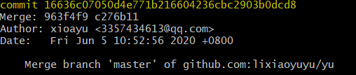
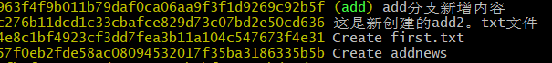

### git指令

[TOC]

基本指令

**git  init**  将一个文件变成git可以管理的仓库

**git status**    查看当前状态  （红色表示未跟踪文件也就是未提交文件到暂存区   绿色已提交到暂存区）

**.git add**   将文件从工作区添加到暂存区

- ```
  - git  add 文件名    `添加一个文件`
  - git  add 文件名1 文件名2  ...     `添加多个文件`
  - git  add  .      `添加工作区全部文件（不包括已经提交过的）`
  ```

**.git commit  - m   "备注内容"**    将文件从暂存区提交到本地仓库

###  时光穿梭机——版本回退 

**git log**     查看当前分支的日志，确定需要回到的时刻点 信息详细  



git log  --pretty =oneline     查看当前分支的日志，确定需要回到的时刻点   便于观察



**git reset  --hard**   **commitid  ( 提交编号 )**      回退到指定的 commit id 时刻的状态

```
commit id可以不用写全，git自动识别，但是也不能写太少，至少需要写前4位字符；
```

**git reflog**   查看全部分支的历史操作，以得到最新的commit id    最全的

### **暂存区操作**

**git checkout 文件**   将暂存区中的文件覆盖掉工作区中的文件

**git rm --cached  文件名**   将指定的文件移除暂存区

### **分支操作**

git branch   查看分支

git  branch   分支名称       创建分支  

git  checkout  分支名称       切换分支  

git  merge   分支名称         合并分支   `将指定分支合并到当前分支`

git  branch  -d   分支名称     删除分支    `不能删除正在使用的分支 应该在其他分支上删除指定的分支`

### **暂时保存**

- git stash：暂存当前的修改不提交
- git stash list：查看已经暂存的历史
- git stash pop ：弹出最近的一次暂存至工作区，同时从list中删除
- git stash apply id：在当前分支应用stash_id 为id的暂存，但不从list中删除

**本地仓库与远程仓库**

### **git clone**

git  clone   远程仓库地址    克隆远程仓库到本地仓库

git  clone   -b  分支名称   远程仓库地址    克隆远程仓库分支到本地仓库

## git pull

git pull   远程仓库地址  远程分支名 :<本地分支名>           拉取远程仓库最新分支的内容并与本地指定的分支合并

```
git pull <远程仓库地址> <分支名> 当只有一个分支名时，这个分支名默认是远程分支名。作用是取回远程主机的指定分支，再与本地的当前分支合并。
git pull <远程主机名>     取回远程主机与当前分支有追踪关系的分支，再与本地的当前分支合并。如果没有追踪关系使用该命令则会报错。
git pull     取回远程与当前分支有唯一追踪关系的分支，再与本地的当前分支合并。如果没有追踪关系使用该命令则会报错。
git pull -p     如果在远程主机删除了某个分支，默认情况下，git pull 不会在拉取远程分支的时候，删除对应的本地分支。如果要删除，加上 -p 选项即可。
git pull --rebase <远程主机名> <远程分支名>:<本地分支名>      有人推送了经过rebase操作的提交，并丢弃了你的本地开发所基于的一些提交，但是你push之后，那些被对方丢弃的提交又出现了，这是对方所不希望看到的。所以在拉取合并时加上 --rebase 选项，git内部会自动检测，合并的结果会丢弃一些提交，符合预期。
```


## git push 

git push  -b  分支  远程仓库地址           `推送分支代码到远程仓库`

git remote add 别名     远程仓库地址   `将指定的远程仓库地址设置别名`

git push <远程主机名> <本地分支名>:<远程分支名>  `作用是将本地的指定分支推送到远程主机的指定分支上`。

```
 git push <远程主机名> <分支名>   当只有一个分支名时，这个分支名默认是本地分支名。作用是将本地的指定分支推送到远程主机的同名分支上。注意如果远程主机不存在该同名分支，则会自动新建同名分支。
 git push <本地主机名> :<远程分支名>     如果省略本地分支名，则表示删除指定的远程分支，因为这等同于推送一个空的本地分支到远程分支
git push <远程主机名> --delete <远程分支名>
git push <远程主机名>    作用是将本地的当前分支推送到远程主机有追踪关系的对应分支上。如果没有追踪关系使用该命令则会报错。
git push   作用是将本地的当前分支推送到远程有唯一追踪关系的对应分支上。如果没有追踪关系使用该命令则会报错。 
git push -u <远程主机名> <本地分支名>    作用是将本地的指定分支推送到远程主机的同名分支。另外因为加了-u参数，所以如果没有追踪关系则会建立，另外如果当前指定分支与多个远程主机存在追踪关系，则指定该远程主机为默认主机，后面就可以不加参数使用git push。
git push --all <远程主机名>   不管是否存在对应的远程分支，将本地的所有分支都推送到远程主机，这时需要使用–all选项。如果远程主机的版本比本地版本更加新，推送时Git会报错，要求先在本地做git pull合并差异或解决冲突，然后再推送到远程主机。但是如果你一定要推送，可以使用下面的–force选项。
git push --force <远程主机名>  使用–force选项，结果导致远程主机上的版本直接被覆盖。除非你很确定要这样做，否则应该尽量避免使用–force选项。
```


 附（对标签tag的推送）`
`推送一个本地标签到远程：`

`$ git push <远程主机名> <本地标签名>`

`推送本地全部未推送过的标签到远程：`

`$ git push <远程主机名> --tags`

`删除一个远程标签（即推送一个空的标签到远程标签）：`

`$ git push <远程主机名> :refs/tags/<远程标签名>`

`在Git v1.7.0 之后，还可以使用下面这种语法删除远程标签：`

`$ git push <远程主机名> --delete tag <远程标签名>`

